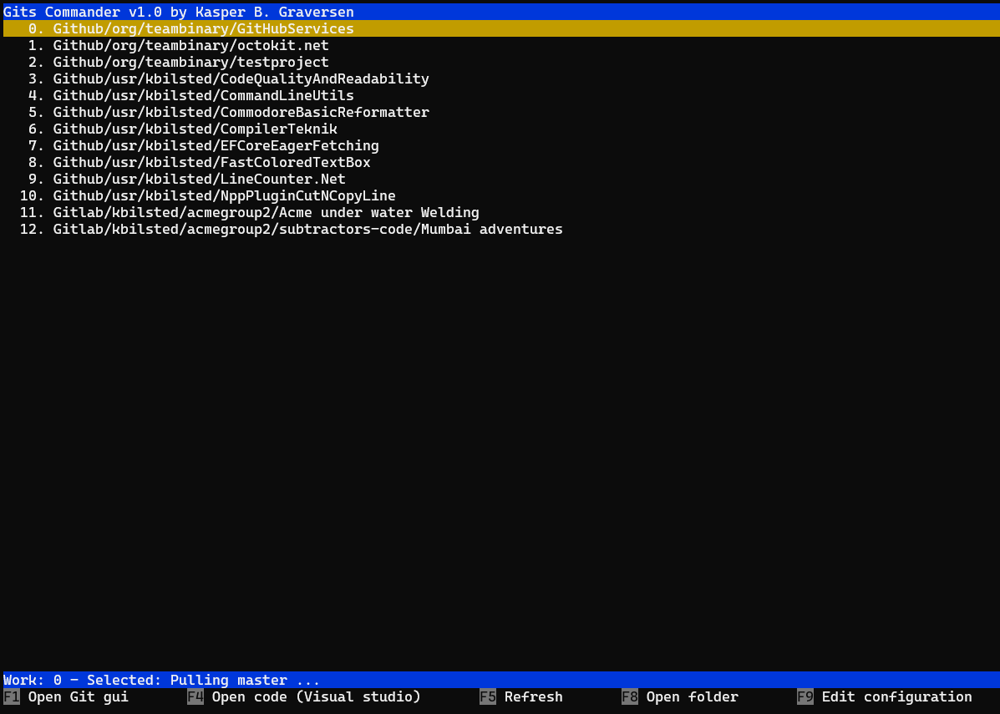

# Gits Commander

Gits commander is a commander-like tool for managing multiple Git repositories across many Git hosting platforms. 



Easily clone all projects a platform for a given organization or user. Easily navigate to specific repositories and open them. 
You can easily pull the latest changes from all repositories so you are always up to date.


Using this tool makes it easy to manage code on a local macine, and it is very easy to ensure the structure of the code repositories is identical on many machines - think of the advantages if all developers of your organization or departmen has the exact same structure.


# 1. Configuration
You can easily setup the repositories you want to clone or pull. Further, you can configure the commands you want executed on a selected on a selected repository.


## 1.1. Configurating data sources
For the moment Github, Gitlab (cloud or local installations) are supported. To setup a a datasource

1. Create an api-key (on github/gitlab/...) with *read-rights* for your repositories. See
  *  https://docs.github.com/en/authentication/keeping-your-account-and-data-secure/creating-a-personal-access-token 
  * or https://docs.gitlab.com/ee/user/profile/personal_access_tokens.html
2. Add it to the json file `appsettings.json` in the corresponding `ApiKey` field.
3. Configure the datasource to your liking, let us take outset in the following configuration
```
"Github/usr/kbilsted": {
    "Connection": {
        "ApiKey": "xyz",
        "SearchApiUrl": "https://api.github.com/search/repositories?q=user:kbilsted&?page={page}&per_page=100&type=all",
        "ReposApiUrl": "https://api.github.com:443/users/kbilsted/repos?page={page}&per_page=100&type=all"
    },
    "RepoNameRegexMatch": ".*",
    "DestinationFolder": "c:\\src"
}
```

* `Github/usr/kbilsted` is the name used in the UI
* Github needs to be configured with 2 urls. Not sure why, but they complement if you want all your repos.
* Gitlab needs to be configured with 2 urls since it supports nested structures of repositories, so one for finding groups and one for the repositories.
* `RepoNameRegexMatch` defines a filter of which repositories to clone
* `DestinationFolder` defines the destination folder

check out the full examples in the `appsettings.json` file in the releases.


# 2. Configurating custom commands on a repository

Launching commands from within Gits Commander is fully configurable. You may need to adjust the commands to your liking, but most of them uses the standard open functionality of the operating system to open a repository in your favorite IDE, a shell or whatever you desire. For example, my current local actions are defined as follows:

```perl
"Launchers": {
	"F1": {
		"Name": "Open repo gui",
		"Command": "C:\\Program Files (x86)\\GitExtensions\\gitextensions.exe",
		"Arguments": [ "browse" ]
	},
	"F4": {
		"Name": "Open code (Visual studio)",
		"Command": "$file$",
		"FilePattern": "*.sln"
	},
	"F5": {
		"Name": "Refresh",
		"Command": "$refreshRepoList$"
	},
	"F8": {
		"Name": "Open folder",
		"Command": "$folder$"
	},
	"F9": {
		"Name": "Edit configuration",
		"Command": "$openAppSettings$"
	}
},
```

You can configure the hotkeys, as well as the commands

incidently, this fully covers the supported meta-words supported by the configuration code. These are

* `$file$` - find a file within the selected repository
* `$refreshRepoList$` - refresh the repo list
* `$folder$` - the folder of the selected repository
* `$openAppSettings$` - opens the configuration file in an editor


# 3. Supported platforms

* Windows
* Mac
* Linux


# 4. Eventmodelling

The code is structured around eventmodelling which I've tried documenting. See more info on this topic at https://eventmodelling.org


# 5. Contribute
Contributions are much welcome or any kind of feedback! Just open an issue..also best before sending a pull request.

Have fun
 Kasper B. Graversen